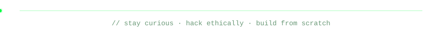

<!-- Profile README for github.com/KazamaNoob — goes in the repo KazamaNoob/KazamaNoob (with the assets/ folder) -->

<p align="center">
  
</p>

<p align="center">
  
</p>

<p align="center">
  
</p>

---

### `~/tools` &nbsp;<sub>ls -la</sub>

| | Project | What it does |
|---|---|---|
| 🕷️ | [**Web-Vulnerability-Scanner**](https://github.com/KazamaNoob/Web-Vulnerability-Scanner) | Multithreaded crawler (BFS + HashSet dedup) that detects SQLi, XSS and open redirects |
| 🛡️ | [**Log_Shield**](https://github.com/KazamaNoob/Log_Shield) | Multi-threaded SIEM + IPS that monitors auth logs and blocks attackers |
| 🔐 | [**Secure-Linux-Password-Manager**](https://github.com/KazamaNoob/Secure-Linux-Password-Manager) | Zero-knowledge CLI manager: AES-256-GCM, PBKDF2, `mlockall`, anti-core-dump |
| 📡 | [**network-scanner**](https://github.com/KazamaNoob/network-scanner) | Port scanner with banner grabbing, service fingerprinting, rate limiting, scan diffing |
| 🧠 | [**Code-Similarity-Detector**](https://github.com/KazamaNoob/Code-Similarity-Detector) | AST-based plagiarism detector that survives renamed variables |
| 🌐 | [**network-analyzer**](https://github.com/KazamaNoob/network-analyzer) | Network analysis tool built with Union-Find, heaps and BFS |

### `~/stack`

```text
python · bash · linux · git · kali
```

### `~/contact`

[LinkedIn](https://www.linkedin.com/in/parikshit-0a455a377/) · [Email](mailto:kazama7105@gmail.com)

<sub>⚠️ All my scanners and security tools are for educational use and authorized testing only.</sub>

<p align="center">
  
</p>
